# 📘 ENGINEERING COLLEGE LIBRARY MANAGEMENT SYSTEM (LMS)
## Complete Project Info Booklet & Navigation Guide (Hinglish)
### 🎓 Data Visualization & Business Intelligence Project Guide

---

## 📑 Table of Contents (Anukramanika)
1. **Project Overview (Yeh Project Kya Hai?)**
2. **Architecture & Project Files (Kaunsi File Kya Kaam Karti Hai?)**
3. **Interactive Flowchart: Kahan Click Karne Par Kahan Jaate Hain? (Navigation Guide)**
4. **Main Menu: Step-by-Step Word-to-Word Working (Option 1 se 13)**
5. **Visualization Dashboard: Submenu ke Sabhi 20 Options ka Deep Dive**
6. **Data Visualization Syllabus Unit-Wise Mapping (Unit 1 to Unit 5)**
7. **Power BI Integration & Business Intelligence Workflow**
8. **Viva / Practical Exam Questions & Answers (Frequently Asked Questions)**
9. **How to Convert this Booklet to PDF (PDF Kaise Banayein?)**

---

# 1. Project Overview (Yeh Project Kya Hai?)

### 🎯 Purpose aur Concept:
Yeh project ek **Engineering College Library Management System (LMS)** hai jise Python 3.x, SQLite, aur Data Science / Data Visualization libraries (Matplotlib, Seaborn, Plotly, Folium, Squarify, Scipy, Statsmodels, Scikit-learn) ke sath banaya gaya hai.

College me total **6 Engineering Departments** hain:
1. **Computer Science (CS)**
2. **AIML (Artificial Intelligence & Machine Learning)**
3. **Mechanical Engineering**
4. **Civil Engineering**
5. **Electronics Engineering**
6. **E&TC (Electronics & Telecommunication)**

### 📊 Database ka Scale:
- **54 Unique Technical Books**: Har branch ke core subjects ki standard textbooks (jaise Tanenbaum, Cormen, Pressman, Shigley, Theraja, etc.).
- **90 Students**: 1st Year se 4th Year tak, jo India ke 10 alag-alag states se aate hain (Maharashtra, Karnataka, Gujarat, Delhi, UP, etc.).
- **280+ Transactions**: Pichle 12 mahino ka real-world borrowing data, jisme active loans, time par return hui books, aur overdue late fines shamil hain.

---

# 2. Architecture & Project Files (Kaunsi File Kya Kaam Karti Hai?)

```
📁 Mini Project/
│
├── 📄 main.py                  # 🎮 Master Controller (CLI Menu, User Input, Issue/Return logic)
├── 📄 db_setup.py              # 🗄️ Database Builder (SQLite schema, tables, synthetic seed data)
├── 📄 preprocessing.py         # ⚙️ Data Cleaning & Processing (Duration, Fines, Pivot Tables, PCA Matrix)
├── 📄 visualizations.py        # 🎨 Plotting Engine (19+ Advanced Visualizations - Static & Interactive)
├── 📄 POWERBI_GUIDE.md         # 📑 Power BI complete guide (DAX, measures, Star Schema, KPI cards)
├── 📄 library.db               # 💾 SQLite Database file (4 interconnected relational tables)
├── 📄 library_export.xlsx      # 📊 Multi-sheet Excel workbook for Power BI desktop
├── 📄 requirements.txt         # 📦 Dependencies list (pandas, seaborn, plotly, folium, etc.)
│
├── 📁 charts/                  # 🖼️ High-resolution PNG image outputs (300 DPI)
└── 📁 interactive/             # 🌐 Web-based interactive maps & charts (HTML format)
```

### File-wise Summary:
1. **`main.py`**:
   - Application ka entry point hai. User ko terminal me ek friendly command-line interface (CLI) deta hai.
   - User inputs validate karta hai (jaise copy count, student ID, book availability).
2. **`db_setup.py`**:
   - `library.db` create karta hai. Agar database nahi hai to 4 tables banata hai (`departments`, `students`, `books`, `transactions`) with foreign key constraints.
   - `Faker` library se realistic Indian student names aur issue dates generate karta hai.
3. **`preprocessing.py`**:
   - Raw database rows ko Pandas DataFrame me convert karta hai.
   - `days_kept = return_date - issue_date` aur `overdue_days = return_date - due_date` calculate karta hai.
   - ₹5/day ke hisaab se late fine calculate karta hai aur status categorize karta hai (`Active On-Time`, `Active Overdue`, `Returned On-Time`, `Returned Overdue`).
4. **`visualizations.py`**:
   - Syllabus ke saare charts plot karta hai. Matplotlib, Seaborn, Plotly Express, Folium maps, Scikit-learn PCA, aur Statsmodels time-series decomposition ko run karta hai.
5. **`POWERBI_GUIDE.md` & `library_export.xlsx`**:
   - Industry-standard BI modeling ke liye multi-table excel export aur DAX measures provide karta hai.

---

# 3. Interactive Flowchart: Kahan Click Karne Par Kahan Jaate Hain?

Yeh visual navigation map aapko dikhata hai ki konsa button/number press karne par software kahan le jata hai:

```mermaid
graph TD
    Start([🚀 Run: python main.py]) --> CheckDB{library.db exists?}
    CheckDB -- No --> InitDB[db_setup.py: Init & Seed Database]
    CheckDB -- Yes --> MainMenu[📋 MAIN MENU: Options 0 to 13]
    InitDB --> MainMenu

    MainMenu -->|Option 1| ViewBooks[📚 View Catalog: Terminal Table]
    MainMenu -->|Option 2| AddBook[➕ Add Book: Inputs Title, Author, Dept, Copies]
    MainMenu -->|Option 3| RemoveBook[➖ Remove/Minus Book: Reduce copies / Delete]
    MainMenu -->|Option 4| SearchBook[🔍 Search: Title / Author / Department]
    MainMenu -->|Option 5| ViewStudents[👥 Student Directory: 90 Students]
    MainMenu -->|Option 6| AddStudent[➕ Add Student: Name, Dept, Year, State]
    MainMenu -->|Option 7| IssueBook[📖 Issue Book: 14-day Due Date Assigned]
    MainMenu -->|Option 8| ReturnBook[📥 Return Book: Auto Fine ₹5/day Calc]
    MainMenu -->|Option 9| Overdue[⚠️ View Overdue Loans Table]
    MainMenu -->|Option 10| History[📜 Student Borrowing Audit History]
    MainMenu -->|Option 11| VizMenu[📊 VISUALIZATION SUBMENU: 20 Options]
    MainMenu -->|Option 12| BatchViz[⚡ Batch Render: Generates all 19 charts at once]
    MainMenu -->|Option 13| ExportPBI[📑 Export to library_export.xlsx for Power BI]
    MainMenu -->|Option 0| ExitApp([❌ Exit Program])

    %% Visualization Submenu breakdown
    VizMenu -->|Opt 1-4: Inventory| VizInv[Bar Chart / Author H-Bar / Dot Plot / Grouped-Stacked Bars]
    VizMenu -->|Opt 5-7: Distribution| VizDist[Hist+KDE / Violin / ECDF / Q-Q / Ridgeline vs Boxplot]
    VizMenu -->|Opt 8-11: Proportions & Assoc| VizProp[Pie Chart / 100% Stacked / Treemap / Scatter / PCA / Pairplot / Slope]
    VizMenu -->|Opt 12-14: Time Series| VizTS[Monthly Trends / Dose-Response / Decomposition / Heatmap]
    VizMenu -->|Opt 15-17: Geospatial| VizGeo[Plotly Choropleth Map / Folium Multi-layer Map / Cartogram]
    VizMenu -->|Opt 18: Design Principles| VizDesign[Bad 3D vs Clean Bar Chart Comparison]
    VizMenu -->|Opt 19: Interactive Dashboard| VizDash[Plotly Interactive HTML Dashboard]
    VizMenu -->|Opt 20: Batch Render| BatchViz
    VizMenu -->|Option 0| MainMenu
```



---

# 4. Main Menu: Step-by-Step Word-to-Word Working (Option 1 se 13)

Jab aap terminal me `python main.py` run karte hain, to main menu show hota hai. Aaiye ek-ek option ko detail me samjhein:

---

### 🔹 Option 1: 📚 View Library Catalog
- **Kya hota hai?**: Library ki sari available aur loaned books ki complete tabular list terminal me display hoti hai.
- **Konsa Function run hota hai?**: `view_books()` in `main.py`.
- **Backend Query**: `SELECT b.book_id, b.title, b.author, d.dept_name, b.total_copies, b.available_copies, b.publisher_state FROM books JOIN departments...`
- **Output Columns**:
  - `ID`: Book ka unique primary key.
  - `Title`: Book ka naam (e.g., *Computer Networks*, *Theory of Machines*).
  - `Author`: Author ka naam (e.g., *Andrew S. Tanenbaum*).
  - `Dept`: Academic Department (e.g., *Computer Science*, *Mechanical*).
  - `Avail/Total`: Shelf par kitni copies bachi hain aur total kitni hain (e.g., `4/5`).
  - `Pub State`: Publisher ka state (e.g., *Maharashtra*, *Delhi*).
- **Kahan wapas jata hai?**: Table print karke wapas Main Menu par aa jata hai.

---

### 🔹 Option 2: ➕ Add New Book
- **Kya hota hai?**: Catalog me nayi engineering textbook add karne ki suvidha deta hai.
- **Konsa Function run hota hai?**: `add_book()` in `main.py`.
- **Step-by-step Input Flow**:
  1. `Enter Title:` -> Book ka naam type karein.
  2. `Enter Author:` -> Author ka naam type karein.
  3. `Select Academic Department (1-6):` -> List me se branch ID chunein (1. CS, 2. Mech, 3. Civil, etc.).
  4. `Enter Total Copies:` -> Copies ki quantity (e.g., 5).
  5. `Enter Publisher State:` -> State name (default: Maharashtra).
- **Backend Action**: `books` table me new row insert hoti hai. Initial `available_copies = total_copies`.
- **Success Message**: `[✓] Success: Added '<Title>' by <Author> (<N> copies).`

---

### 🔹 Option 3: ➖ Remove / Minus Book (Inventory Control)
- **Kya hota hai?**: Agar copies phat gayi/lost ho gayi to copy count kam karna, ya book ko record se delete karna.
- **Konsa Function run hota hai?**: `remove_book()` in `main.py`.
- **Step-by-step Input Flow**:
  1. `Enter Book ID to remove:` -> Book ID daalein.
  2. System book details fetch karta hai aur active loans check karta hai:
     - `Found: '<Title>' by <Author>`
     - `Total Copies: 5 | Available on Shelf: 3 | Currently Loaned: 2`
  3. Two sub-options appear:
     - **Sub-option 1 (Decrease copy count)**: Kitni unloaned copies minus karni hain (e.g., 1 ya 2). Yeh `total_copies` aur `available_copies` dono update karta hai.
     - **Sub-option 2 (Completely delete record)**: Agar book kisi student ke paas loaned hai, to system mana kar deta hai: *"Cannot delete completely: 2 copies are currently on loan. Please return all active loans first."* Yeh database integrity protect karta hai!

---

### 🔹 Option 4: 🔍 Search Books
- **Kya hota hai?**: Title, author, ya department ke keyword se instant search karta hai.
- **Konsa Function run hota hai?**: `search_books()` in `main.py`.
- **Step-by-step Input Flow**:
  - `Enter search title / author / department keyword:`
  - Aap likh sakte hain: `Tanenbaum` ya `Mechanical` ya `Database` ya `Data`.
- **Backend Query**: `WHERE b.title LIKE '%keyword%' OR b.author LIKE '%keyword%' OR d.dept_name LIKE '%keyword%'`.
- **Output**: Matching books ki concise list print hoti hai.

---

### 🔹 Option 5: 👥 View Student Directory
- **Kya hota hai?**: College ke sabhi registered students ki list dikhata hai.
- **Konsa Function run hota hai?**: `view_students()` in `main.py`.
- **Display Fields**: `Student ID | Name | Department | Academic Year (Year 1-4) | Home State`.

---

### 🔹 Option 6: ➕ Add New Student
- **Kya hota hai?**: Naye student ka library membership card generate karta hai.
- **Konsa Function run hota hai?**: `add_student()` in `main.py`.
- **Step-by-step Input Flow**:
  1. `Enter Student Full Name:` (e.g., Rahul Sharma).
  2. `Select Department ID (1-6)` (e.g., 1 for CS).
  3. `Enter Academic Year (1-4)` (e.g., 3 for 3rd Year).
  4. `Enter Home State` (e.g., Maharashtra, Karnataka).
- **Backend Action**: `students` table me insert karta hai.

---

### 🔹 Option 7: 📖 Issue a Book (Auto Due Date)
- **Kya hota hai?**: Student ko book borrow karwata hai aur automated 14 days ka loan period assign karta hai.
- **Konsa Function run hota hai?**: `issue_book()` in `main.py`.
- **Step-by-step Input Flow**:
  1. `Enter Student ID:` (e.g., 12).
  2. `Enter Book ID to issue:` (e.g., 5).
- **Internal Safety Validations**:
  - Kya Student ID database me exist karta hai? (Agar nahi, to error message).
  - Kya Book ID exist karta hai?
  - **Availability Check**: Kya `available_copies > 0` hai? Agar available copies 0 hain, to turant alert aata hai: `[!] Unavailable: Currently 0 copies on shelf.`
- **Date Calculation**:
  - `issue_date` = Current system date (`YYYY-MM-DD`).
  - `due_date` = `issue_date + timedelta(days=14)`.
- **Backend Database Actions**:
  - `transactions` table me nayi row add hoti hai (`return_date = NULL`, `fine_amount = 0.0`).
  - `books` table me `available_copies = available_copies - 1` ho jata hai.
- **Success Output**:
  - `[✓] Issued 'Deep Learning' to Aarav Patil.`
  - `Loan Period: 14 Days | Due Date: 2026-10-11`

---

### 🔹 Option 8: 📥 Return a Book (Auto Fine Calculation)
- **Kya hota hai?**: Student dwara book wapas karne par inventory shelf count restore karta hai aur overdue fine calculate karta hai.
- **Konsa Function run hota hai?**: `return_book()` in `main.py`.
- **Step-by-step Input Flow**:
  - `Enter Transaction ID to return:` (e.g., 45).
- **Backend Working & Math**:
  1. System transaction record check karta hai.
  2. Agar book pehle hi return ho chuki hai, to bata deta hai: `[i] Notice: Book was already returned previously.`
  3. System date se check karta hai:
     $$\text{overdue\_days} = \max(0, \text{Return Date} - \text{Due Date})$$
  4. Fine Rule: **₹5.00 per day** overdue:
     $$\text{fine\_amount} = \text{overdue\_days} \times 5.0$$
  5. `transactions` table me `return_date` update hota hai aur `fine_amount` record hota hai.
  6. `books` table me shelf availability badh jati hai: `available_copies = available_copies + 1`.
- **Output Screen**:
  - Agar time par return kiya: `[✓] Returned on-time. Fine Due: ₹0.00.`
  - Agar late return kiya: `[!] OVERDUE NOTICE: 6 days late. Fine Due: ₹30.00 (@ ₹5/day).`

---

### 🔹 Option 9: ⚠️ View Overdue Loans
- **Kya hota hai?**: Librarian ko instantly un sabhi students ki list dikhata hai jinhone due date cross kar li hai aur book wapas nahi ki hai.
- **Konsa Function run hota hai?**: `view_overdue_books()` in `main.py`.
- **Logic**: `preprocessing.get_cleaned_transactions()` se filter karta hai jahan `status.str.contains('Overdue')`.
- **Output Table**: `Txn ID | Student Name | Book Title | Due Date | Days Late | Live Fine (₹)`.

---

### 🔹 Option 10: 📜 Student Borrowing History
- **Kya hota hai?**: Kisi specific student ka pura audit record nikalta hai (usne kab-kab konsi book li, kab return ki, kitna fine bhara).
- **Konsa Function run hota hai?**: `student_history()` in `main.py`.
- **Input**: `Enter Student ID:` (e.g., 14).
- **Output Table**: Complete chronological transactions with book titles, issue date, due date, return status, and effective fines.

---

### 🔹 Option 11: 📊 Open Data Visualization Dashboard
- **Kya hota hai?**: Yeh Data Visualization Submenu kholta hai jisme **20 dedicated visual analytics options** hain! (Inka pura detail Section 5 me dekhein).

---

### 🔹 Option 12: ⚡ Generate All Visual Analytics (One-Click Render)
- **Kya hota hai?**: Bina kisi ek-ek option ko select kiye, poore 19 static aur interactive charts ko ek sath batch process karke `charts/` aur `interactive/` folders me export kar deta hai!
- **Useful for**: Jab viva examiner ya professor bole ki "Saare charts generate karke dikhao". Sirf Option 12 press kijiye aur kuch seconds me saari images ready!

---

### 🔹 Option 13: 📑 Export Dataset for Power BI
- **Kya hota hai?**: SQLite database ke charo tables (`departments`, `students`, `books`, `transactions`) ko ek clean, multi-sheet Excel file `library_export.xlsx` me export karta hai.
- **Kahan use hota hai?**: Microsoft Power BI Desktop me data import karne ke liye direct source ban jata hai.

---

### 🔹 Option 0: ❌ Exit
- Program ko safely terminate karta hai aur goodbye message display karta hai.

---

# 5. Visualization Dashboard: Submenu ke Sabhi 20 Options ka Deep Dive

Jab aap Main Menu me **Option 11** select karte hain, to Visualization Dashboard khulta hai:

```
====================================================================
              LIBRARY DATA VISUALIZATION DASHBOARD
====================================================================
  1.  Collection by Department (CS, Mech, Civil, AIML, etc.)
  2.  Author Distribution & Most Borrowed Authors
  3.  Cleveland Dot Plot (High Data-Ink Book Inventory)
  4.  Loan Status Breakdown (Grouped & Stacked Bar Charts)
  5.  Loan Duration Spread (Histogram, KDE, Violin Plot)
  6.  Statistical Diagnostics (ECDF, Normal Q-Q, Log Transform)
  7.  Axis Orientation Comparison (Ridgeline vs Boxplots)
  8.  Proportions & Treemap (Pie Chart, 100% Stacked, Treemap)
  9.  Associations & PCA (Scatter+Regression, Heatmap, PCA 2D)
 10.  Pairplot Matrix across Library Metrics
 11.  Paired Slope Chart (Due Date vs Actual Return Deviation)
 12.  Borrowing Time Series & Trends (Monthly Lines, Smoothing)
 13.  Advanced Time Series (Dose-Response Curve & Decomposition)
 14.  Monthly Borrowing Intensity Heatmap
 15.  Geospatial Demographics: Interactive Indian States Choropleth
 16.  Geospatial Layers: Campus Reading Rooms & Student Origins Map
 17.  Cartogram: Proportional State Symbol Map
 18.  Design Principles Demo: Poor 3D Clutter vs Clean Bar Chart
 19.  Open Interactive Plotly Dashboard in Browser
 20.  ⚡ Generate All Visual Analytics (Batch Render)
  0.  ↩ Back to Main Menu
====================================================================
```

Har ek option ki complete details niche di gayi hain:

---

### 📊 Option 1: Collection by Department
- **Function**: `plot_department_books()`
- **Output File**: `charts/books_by_department.png`
- **Chart Type**: Vertical Bar Chart (Sorted descending).
- **Kya dikhata hai?**: Har engineering department ke paas kitni total book copies available hain. Bars ke top par direct numbers likhe hote hain (e.g., 48 copies).
- **Syllabus Topic**: *Visualizing Amounts: Bar Plots*.

---

### 📊 Option 2: Author Distribution & Most Borrowed Authors
- **Function**: `plot_author_analytics()`
- **Output File**: `charts/author_distribution.png`
- **Chart Type**: Horizontal Bar Chart.
- **Kya dikhata hai?**: Top 10 most popular authors jinki books students ne sabse zyada issue karwayi hain, sath me unke total catalog titles ka count.
- **Syllabus Topic**: *Visualizing Amounts with Categorical Labels*.

---

### 📊 Option 3: Cleveland Dot Plot
- **Function**: `plot_cleveland_dot_plot()`
- **Output File**: `charts/dot_books_per_dept.png`
- **Chart Type**: Cleveland Dot Plot (Horizontal reference line + Circular data points).
- **Kya dikhata hai?**: Bar chart ka high data-ink alternative. Isme unnecessary ink (heavy colored bars) hatakar precise points se inventory levels dikhaye gaye hain.
- **Syllabus Topic**: *Cleveland Dot Plots & Data-Ink Ratio*.

---

### 📊 Option 4: Loan Status Breakdown (Grouped & Stacked Bars)
- **Function**: `plot_loan_status_grouped_stacked()`
- **Output File**: `charts/loan_status_breakdown.png`
- **Chart Type**: 2-panel figure: Left = Grouped Bar Chart, Right = Stacked Bar Chart.
- **Colors**: Green = Returned, Blue = Active Issued, Red = Overdue.
- **Kya dikhata hai?**: Har department me kitni books return ho chuki hain, kitni abhi reading desk par hain, aur kitni late/overdue hain.
- **Syllabus Topic**: *Grouped & Stacked Bar Charts*.

---

### 📊 Option 5: Loan Duration Spread (Hist + KDE, Violin Plot)
- **Function**: `plot_duration_distributions()`
- **Output File**: `charts/duration_distributions.png`
- **Chart Type**: 3-panel figure:
  1. *Panel 1*: Single Histogram + KDE curve (Days Kept distribution).
  2. *Panel 2*: Overlaid KDE density curves across all 6 departments.
  3. *Panel 3*: Seaborn Violin Plot with quartile lines showing median and spread.
- **Kya dikhata hai?**: Student kitne din tak book apne paas rakhte hain. Isse pata chalta hai ki peak borrowing duration 10-14 din ka hai.
- **Syllabus Topic**: *Visualizing Single & Multiple Distributions, Violin Plots*.

---

### 📊 Option 6: Statistical Diagnostics (ECDF, Q-Q Plot, Log Transform)
- **Function**: `plot_statistical_diagnostics()`
- **Output File**: `charts/statistical_diagnostics.png`
- **Chart Type**: 3-panel statistical graphic:
  1. *ECDF Plot (Empirical Cumulative Distribution Function)*: Fine distribution ka cumulative percentage.
  2. *Normal Q-Q Plot (Quantile-Quantile)*: Scipy stats ke zariye check karta hai ki kya library fines normally distributed hain.
  3. *Skewed vs Log Transformation*: Raw skewed fines histogram vs `log1p(fine)` transformed Gaussian-like shape.
- **Kya dikhata hai?**: Highly skewed financial/fine data ko kaise handle aur diagnose karte hain.
- **Syllabus Topic**: *ECDF, Q-Q Normal Probability Plots, Log Transformations*.

---

### 📊 Option 7: Axis Orientation Comparison (Ridgeline vs Boxplots)
- **Function**: `plot_vertical_vs_horizontal_layouts()`
- **Output File**: `charts/vertical_vs_horizontal.png`
- **Chart Type**:
  - *Left (Horizontal Orientation)*: Overlapping density curves (Ridgeline style) along horizontal X-axis.
  - *Right (Vertical Orientation)*: Categorical Boxplots showing outliers along vertical Y-axis.
- **Kya dikhata hai?**: Horizontal continuous density flow vs Vertical discrete quartile representation ka direct comparison.
- **Syllabus Topic**: *Axis Orientation & Layout Decisions*.

---

### 📊 Option 8: Proportions & Treemap
- **Function**: `plot_proportions_and_treemap()`
- **Output File**: `charts/proportions_and_treemap.png`
- **Chart Type**: 3-panel composition:
  1. *Pie Chart*: Department loan share (Proportions of whole).
  2. *100% Stacked Bar Chart*: Har department me status composition 100% normalized scale par.
  3. *Nested Treemap*: Department -> Specific Book Title borrowing volume using `squarify`.
- **Syllabus Topic**: *Visualizing Proportions, 100% Stacked Bars, Nested Treemaps*.

---

### 📊 Option 9: Associations & PCA (Grammar of Graphics & Dimension Reduction)
- **Function**: `plot_associations_and_pca()`
- **Output File**: `charts/associations_and_pca.png`
- **Chart Type**: 3-panel analytics:
  1. *Grammar of Graphics Layering*: Data points (`geom_point`) + Fitted regression trend line (`geom_smooth`). Overdue days vs fine amount.
  2. *Correlogram*: Correlation heatmap between numeric metrics (`days_kept`, `fine`, `copies`).
  3. *PCA 2D Projection*: Scikit-Learn Principal Component Analysis jo student borrowing habit ko 2 dimensions (PC1 = Borrowing Volume, PC2 = Department Focus) me cluster karta hai.
- **Syllabus Topic**: *Grammar of Graphics, Correlograms, Dimension Reduction (PCA)*.

---

### 📊 Option 10: Pairplot Matrix
- **Function**: `plot_borrowing_pairplot()`
- **Output File**: `charts/borrowing_pairplot.png`
- **Chart Type**: Seaborn Pairplot with diagonal KDE and off-diagonal scatter plots, colored by department.
- **Kya dikhata hai?**: Ek sath sabhi numerical variables ka pairwise relationship.
- **Syllabus Topic**: *Multivariate Data Exploration & Pairplots*.

---

### 📊 Option 11: Paired Slope Chart
- **Function**: `plot_paired_slope_chart()`
- **Output File**: `charts/due_vs_return_slope.png`
- **Chart Type**: Two-point Slope Chart.
- **Kya dikhata hai?**: Left side par expected due date (Day 14) aur Right side par actual return date.
  - Green line = On-time return ($\le 14$ days).
  - Red line = Overdue deviation ($> 14$ days).
- **Syllabus Topic**: *Visualizing Paired Data & Deviation*.

---

### 📊 Option 12: Borrowing Time Series & Trends
- **Function**: `plot_time_series_and_trends()`
- **Output File**: `charts/time_series_and_trends.png`
- **Chart Type**: 3-panel time series:
  1. *Individual Monthly Line*: College-wide monthly book issues.
  2. *Multiple Time Series*: Branch-wise comparison over 12 months.
  3. *Trend Smoothing*: 3-Month Rolling Average + Linear Regression trend fit line with $R^2$ score.
- **Syllabus Topic**: *Time Series Trends, Rolling Averages & Regression Smoothing*.

---

### 📊 Option 13: Advanced Time Series (Dose-Response & Decomposition)
- **Function**: `plot_advanced_time_series()`
- **Output File**: `charts/advanced_time_series.png`
- **Chart Type**: 3-panel advanced series:
  1. *Dose-Response Curve*: Polynomial regression curve jahan Overdue Days = Dose, Fine Amount = Response.
  2. *Multi-Response Dual Axis*: Issues (blue line), Returns (green line) on primary axis + Fines collected (red line) on secondary Y-axis.
  3. *Seasonal Decomposition*: Statsmodels additive decomposition jo data ko Trend, Seasonal cycle, aur Residual noise me split karta hai.
- **Syllabus Topic**: *Dose-Response Functions, Multi-Response Series, Seasonal Decomposition*.

---

### 📊 Option 14: Monthly Activity Heatmap
- **Function**: `plot_monthly_activity_heatmap()`
- **Output File**: `charts/activity_heatmap.png`
- **Chart Type**: 2D Density Heatmap with continuous `YlGnBu` color gradient and integer count annotations.
- **Kya dikhata hai?**: X-axis = Month (Jan-Dec), Y-axis = Department. Kaunse mahine me kis department me exams ya projects ke time borrowing spike aati hai.
- **Syllabus Topic**: *Heatmaps & Continuous Color Scales*.

---

### 📊 Option 15: Geospatial Demographics (Plotly Choropleth Map)
- **Function**: `plot_geospatial_choropleth()`
- **Output File**: `interactive/choropleth_map.html`
- **Kya hota hai?**: Interactive web browser map open hota hai. India ke states color shade ke sath highlight hote hain based on number of students.
- **Interaction**: State par mouse le jane (hover) par student count aur state name tooltip me dikhta hai.
- **Syllabus Topic**: *Geospatial Projections & Choropleth Mapping*.

---

### 📊 Option 16: Geospatial Layers (Campus Reading Rooms & Origins)
- **Function**: `plot_folium_campus_map()`
- **Output File**: `interactive/folium_map.html`
- **Kya hota hai?**: Folium Leaflet interactive map open hota hai with 2 toggleable layers:
  - *Layer 1 (Blue Circles)*: Student home state origins (size proportional to student count).
  - *Layer 2 (Red Book Markers)*: College campus ke alag-alag departmental reading rooms (CS reading room, Mech library, etc.).
- **Syllabus Topic**: *Multi-Layer Geospatial Mapping & GIS Layers*.

---

### 📊 Option 17: Cartogram: Proportional State Symbol Map
- **Function**: `plot_proportional_cartogram()`
- **Output File**: `charts/cartogram_proportional.png`
- **Chart Type**: Simplified Cartogram on WGS84 Geographic Coordinates (Longitude vs Latitude).
- **Kya dikhata hai?**: Geographical bubble size state ke total borrowing volume ke proportional hoti hai.
- **Syllabus Topic**: *Cartograms & Proportional Symbol Maps*.

---

### 📊 Option 18: Design Principles Demo (Bad 3D vs Clean Bar Chart)
- **Function**: `plot_design_principles_demo()`
- **Output File**: `charts/design_principles_comparison.png`
- **Chart Type**: Side-by-side comparison:
  - *Left (POOR CHART)*: 3D Cluttered Bar Chart with fake perspective, rainbow colors, and visual occlusion (Edward Tufte's Chartjunk).
  - *Right (CLEAN CHART)*: Clean 2D Horizontal Bar Chart with high data-ink ratio and direct number labels.
- **Syllabus Topic**: *Design Principles, Chartjunk Elimination, Proportional Ink Principle*.

---

### 📊 Option 19: Interactive Plotly Dashboard
- **Function**: `plot_interactive_plotly_dashboard()`
- **Output File**: `interactive/interactive_dashboard.html`
- **Kya hota hai?**: Browser me rich interactive dashboard open hota hai. Isme zoom, pan, hover tooltips, box-select, aur PNG download buttons shamil hain.
- **Syllabus Topic**: *Interactive Dashboards & Dynamic Visual Exploration*.

---

### 📊 Option 20: ⚡ Batch Render
- Sabhi charts ko ek click me generate karke unke status terminal me print karta hai.

---

### 📊 Option 0: ↩ Back to Main Menu
- Submenu se bahar aakar wapas Main LMS menu par le jata hai.

---

# 6. Data Visualization Syllabus Unit-Wise Mapping (Unit 1 to Unit 5)

Aapke college syllabus ke mutabiq har ek concept project me kahan implement hua hai:

| Unit | Course Topic / Concept | Implemented Feature & Chart Function | Output Location |
| :--- | :--- | :--- | :--- |
| **Unit 1** | Design Principles & Chartjunk | `plot_design_principles_demo()`: 3D clutter vs clean horizontal bar | `charts/design_principles_comparison.png` |
| **Unit 2** | Data Preprocessing & Cleaning | `preprocessing.py`: Days kept, overdue days, fine calculations | Clean Pandas DataFrames |
| **Unit 2** | Multivariate Pairplot | `plot_borrowing_pairplot()`: Hue by department with KDE diagonals | `charts/borrowing_pairplot.png` |
| **Unit 2** | Violin Plot & Densities | `plot_duration_distributions()`: Violin plot with quartile markings | `charts/duration_distributions.png` |
| **Unit 2** | Heatmap with Continuous Scales | `plot_monthly_activity_heatmap()`: Dept x Month matrix with YlGnBu colormap | `charts/activity_heatmap.png` |
| **Unit 2** | Interactive Visualization | `plot_interactive_plotly_dashboard()`: Plotly interactive web chart | `interactive/interactive_dashboard.html` |
| **Unit 2** | Grammar of Graphics (Layering) | `plot_associations_and_pca()`: Scatter (`geom_point`) + Regression Line (`geom_smooth`) | `charts/associations_and_pca.png` |
| **Unit 3** | Visualizing Amounts: Bar Plots | `plot_department_books()`: Total books per department | `charts/books_by_department.png` |
| **Unit 3** | Visualizing Amounts: Dot Plots | `plot_cleveland_dot_plot()`: Cleveland dot plot comparing catalog depth | `charts/dot_books_per_dept.png` |
| **Unit 3** | Grouped & Stacked Bars | `plot_loan_status_grouped_stacked()`: Loan status (Returned, Active, Overdue) | `charts/loan_status_breakdown.png` |
| **Unit 3** | Single Distribution: Hist + KDE | `plot_duration_distributions()`: Histogram + KDE density of days kept | `charts/duration_distributions.png` |
| **Unit 3** | Multiple Distributions Overlaid | `plot_duration_distributions()`: Overlaid KDE density curves across all departments | `charts/duration_distributions.png` |
| **Unit 3** | Empirical Cumulative Distribution (ECDF)| `plot_statistical_diagnostics()`: ECDF plot of overdue fine distributions | `charts/statistical_diagnostics.png` |
| **Unit 3** | Normal Quantile–Quantile (Q-Q) Plot | `plot_statistical_diagnostics()`: Q-Q plot comparing fine amounts to normal dist | `charts/statistical_diagnostics.png` |
| **Unit 3** | Highly Skewed Distributions | `plot_statistical_diagnostics()`: Raw skewed fine histogram vs `log1p(fine)` | `charts/statistical_diagnostics.png` |
| **Unit 4** | Vertical vs Horizontal Axis Layouts | `plot_vertical_vs_horizontal_layouts()`: Ridgeline KDE vs Boxplots | `charts/vertical_vs_horizontal.png` |
| **Unit 4** | Proportions: Case for Pie Charts | `plot_proportions_and_treemap()`: Department loan share pie chart | `charts/proportions_and_treemap.png` |
| **Unit 4** | Proportions: 100% Stacked Bar | `plot_proportions_and_treemap()`: 100% stacked bar showing status proportions | `charts/proportions_and_treemap.png` |
| **Unit 4** | Nested Proportions: Treemap | `plot_proportions_and_treemap()`: Squarify treemap of Dept -> Book Titles | `charts/proportions_and_treemap.png` |
| **Unit 4** | Associations: Scatter Plots | `plot_associations_and_pca()`: Fine amount vs overdue days scatter plot | `charts/associations_and_pca.png` |
| **Unit 4** | Associations: Correlograms | `plot_associations_and_pca()`: Correlation matrix heatmap of quantitative variables| `charts/associations_and_pca.png` |
| **Unit 4** | Dimension Reduction (PCA) | `plot_associations_and_pca()`: 2D PCA projection clustering student habits | `charts/associations_and_pca.png` |
| **Unit 4** | Paired Data: Slope Chart | `plot_paired_slope_chart()`: Expected due date (+14d) vs actual return offset | `charts/due_vs_return_slope.png` |
| **Unit 5** | Individual Time Series | `plot_time_series_and_trends()`: Monthly issue volume line chart | `charts/time_series_and_trends.png` |
| **Unit 5** | Multiple Time Series | `plot_time_series_and_trends()`: Multi-line chart per academic department | `charts/time_series_and_trends.png` |
| **Unit 5** | Dose–Response Curve | `plot_advanced_time_series()`: Polynomial curve of fine buildup over overdue days| `charts/advanced_time_series.png` |
| **Unit 5** | Multiple Response Variables | `plot_advanced_time_series()`: Dual-axis monthly issues, returns, and revenue | `charts/advanced_time_series.png` |
| **Unit 5** | Trend Smoothing & Regression Fit | `plot_time_series_and_trends()`: 3-month rolling average + linear regression | `charts/time_series_and_trends.png` |
| **Unit 5** | Detrending & Decomposition | `plot_advanced_time_series()`: `seasonal_decompose` (Trend, Seasonal, Resid) | `charts/advanced_time_series.png` |
| **Unit 5** | Projections & Choropleth Mapping | `plot_geospatial_choropleth()`: Interactive Plotly choropleth of Indian states | `interactive/choropleth_map.html` |
| **Unit 5** | Multi-Layer Geospatial Mapping | `plot_folium_campus_map()`: Folium map with Student Origins & Reading Rooms | `interactive/folium_map.html` |
| **Unit 5** | Simplified Cartogram Mapping | `plot_proportional_cartogram()`: Proportional bubble symbol map by state issues | `charts/cartogram_proportional.png` |

---

# 7. Power BI Integration & Business Intelligence Workflow

Jab aap Main Menu me **Option 13** chunte hain, to system `library_export.xlsx` file generate karta hai.

### Star Schema Data Model:
Power BI Desktop me 4 tables aapas me relate hoti hain:
- **`transactions` (Fact Table)**: Contains `txn_id`, `issue_date`, `due_date`, `return_date`, `fine_amount`.
- **`books` (Dimension Table)**: Connected via `book_id` (1-to-Many).
- **`students` (Dimension Table)**: Connected via `student_id` (1-to-Many).
- **`departments` (Dimension Table)**: Connected to `books` via `dept_id` (1-to-Many).

### Essential DAX Measures Provided:
1. **Total Issues Count**:
   ```dax
   Total_Issues = COUNTROWS(transactions)
   ```
2. **Total Late Fines Collected**:
   ```dax
   Total_Fines = SUM(transactions[fine_amount])
   ```
3. **Active Loans On Hand**:
   ```dax
   Active_Loans = CALCULATE(COUNTROWS(transactions), ISBLANK(transactions[return_date]))
   ```
4. **Overdue Loan Rate (%)**:
   ```dax
   Overdue_Rate = DIVIDE(
       CALCULATE(COUNTROWS(transactions), transactions[fine_amount] > 0),
       COUNTROWS(transactions),
       0
   ) * 100
   ```

Complete step-by-step instructions ke liye [`POWERBI_GUIDE.md`](file:///c:/Users/Niosh%20Mate/OneDrive/3RD%20YEAR/DV/Mini%20Project/POWERBI_GUIDE.md) refer karein.

---

# 8. Viva / Practical Exam Questions & Answers (Frequently Asked Questions)

### Q1: Is project ka core purpose kya hai?
**Ans**: Yeh ek Engineering College Library Management System hai jisme core database operations (book issue, return, inventory management, late fine) ke sath-sath syllabus ke sabhi modern Data Visualization techniques (EDA, statistical distributions, time-series forecasting, PCA dimension reduction, geospatial choropleths, aur Power BI BI reporting) ko implement kiya gaya hai.

### Q2: 3D bar chart ko "Poor Chart" kyun kaha gaya hai?
**Ans**: Edward Tufte ke **Proportional Ink Principle** ke mutabiq, visual area data magnitude ke proportional hona chahiye. 3D charts me fake depth perception ki wajah se front bars back bars ko occlude (hide) kar deti hain aur reading inaccurate ho jati hai. 2D horizontal bar chart me high data-ink ratio aur zero distortion hota hai.

### Q3: Cleveland Dot Plot ka bar chart par kya advantage hai?
**Ans**: Bar charts me pure bar ka heavy color area sirf ek number ko represent karta hai. Cleveland dot plot me baseline se sirf ek clean dotted reference line aur dot hoti hai, jisse visual clutter kam hota hai aur viewer ka dhyan directly data value par jata hai.

### Q4: ECDF aur Histogram me kya difference hai?
**Ans**: Histogram bin size par depend karta hai (alag bin size se shape badal sakti hai). **ECDF (Empirical Cumulative Distribution Function)** me koi binning bias nahi hota. Har single data point directly plot hota hai aur yeh 0 se 1 tak cumulative probability dikhata hai.

### Q5: Project me PCA (Principal Component Analysis) kyun use kiya gaya hai?
**Ans**: Har student 6 alag-alag engineering branches ki books issue karwata hai (6 dimensions). PCA un 6 dimensions ko compress karke 2 Principal Components (PC1 = Overall Borrowing Volume, PC2 = Department Specialization) me convert kar deta hai, jisse hum students ke reading clusters ko 2D scatter plot me visualize kar sakte hain.

### Q6: Dose-Response curve yahan kya signify karta hai?
**Ans**: Medicine me drug dose vs body response hota hai. Hamare project me **Dose = Overdue Days** (kitne din late hua) aur **Response = Fine Amount (₹)**. Polynomial curve dikhata hai ki jaise-jaise din badhte hain, fine ka financial impact linearly/exponentially badhta hai.

### Q7: Seasonal Decomposition me period=3 kyun choose kiya gaya?
**Ans**: College me academic trimesters/quarters hote hain (Exams, Midterms, Project submission months). Period=3 se regular quarterly borrowing spikes aur seasonal trends residual noise se alag ho jate hain.

---

# 9. How to Convert this Booklet to PDF (PDF Kaise Banayein?)

Aapke project folder me ek ready-to-print file **`PROJECT_BOOKLET.html`** bana di gayi hai jisme:
- Professional styling, clean typography, colored badges, aur tables shamil hain.
- Print CSS rules added hain taaki print ya PDF export karte waqt proper page breaks aur clean margins milein.

### Steps to Save as PDF:
1. Apne browser (Google Chrome ya Microsoft Edge) me `PROJECT_BOOKLET.html` ko open karein.
2. Keyboard par **`Ctrl + P`** (Print) dabayein.
3. Destination me **"Save as PDF"** select karein.
4. Options me **"Background graphics"** checkbox ko **tick / enable** karein taaki colors aur table formatting intact rahe.
5. **Save** par click karein! Aapki detailed, professionally styled PDF booklet ready ho jayegi!
